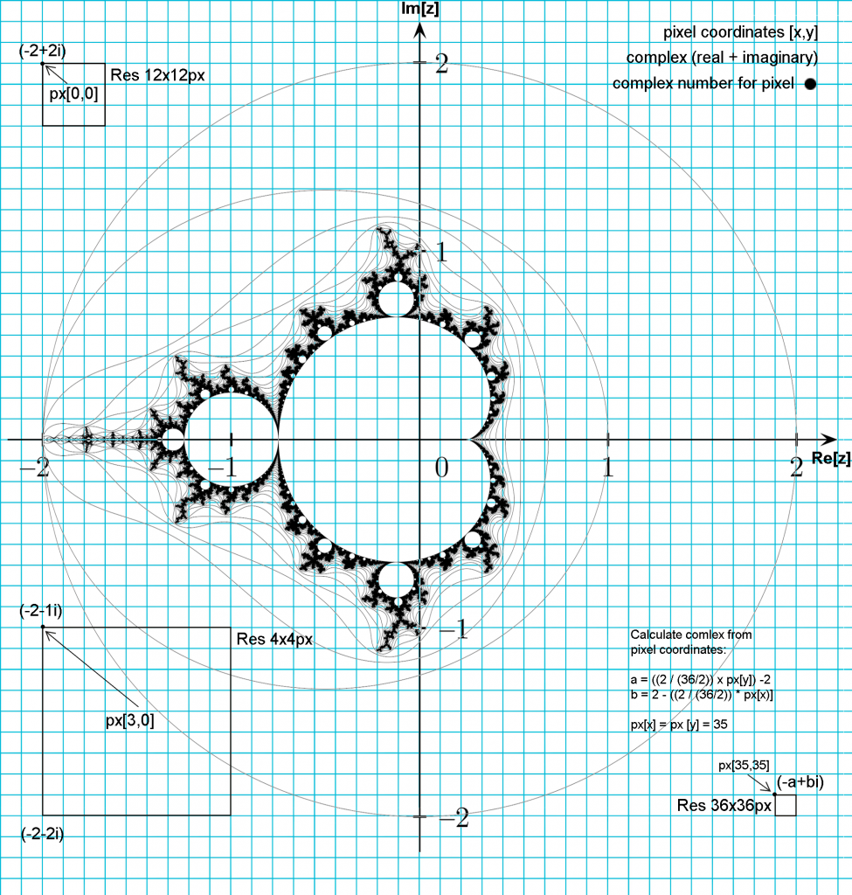

## Mandelbrot Set

This section contains a basic explanation about the Mandelbrot Set. 

* Detailed explanations about the Mandelbrot Set can be found in [Wikipedia](https://en.wikipedia.org/wiki/Mandelbrot_set).
* A very comprehensive information about Mandelbrot Set in the [Mu-Ency - The Encyclopedia of the Mandelbrot Set](https://mrob.com/pub/muency.html).
* And wikiwand.com also contains [very good explanations about basic Mandelbrot concepts](https://www.wikiwand.com/en/Mandelbrot_set).

### Math

Basically, this is the mathematical basic Mandelbrot formula (for complex numbers):

```
f(z) = z² + c
```

where `z` and `c` are complex number. 

The Mandelbrot Set is the set of complex numbers `c` for which the function does not diverge when iterated from z=0.
That means, given a `c` complex number, if you apply the formula to that number `n` times using the previous result as the new `z` number, that `c` belongs to Mandelbrot Set if the sequence does not diverge.

### Drawing the fractal

You can represent those complex number in a graph where x-axis is the real part of the complex number and y-axis is the imaginary part.

It draws the portion of the graph between -2 and 2 real and imaginary parts.
Mandelbrot Set is inside those limits.


