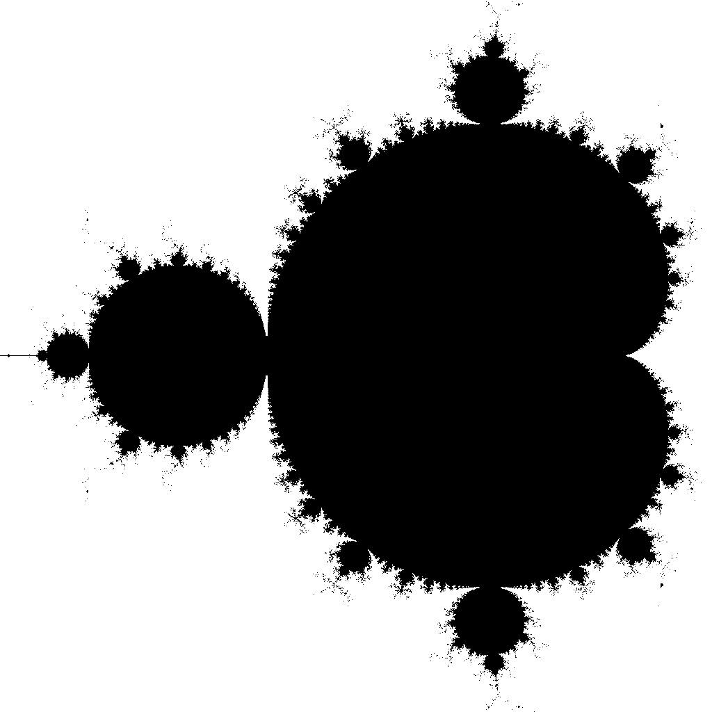
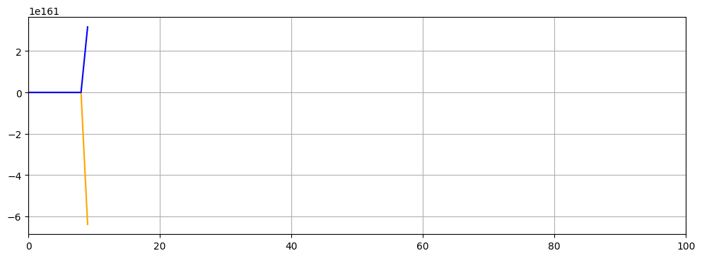
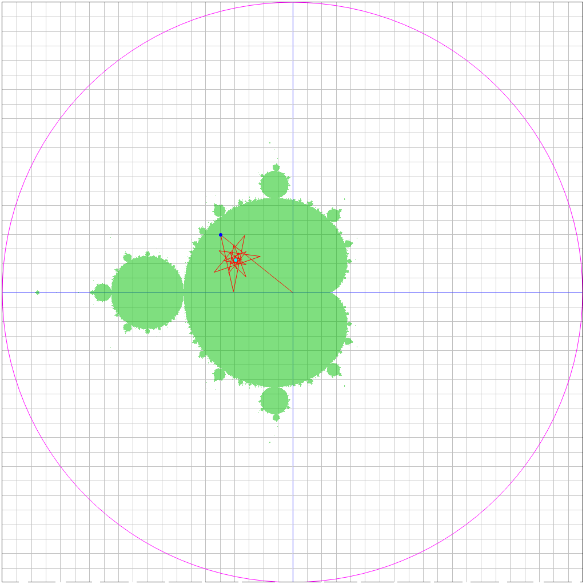
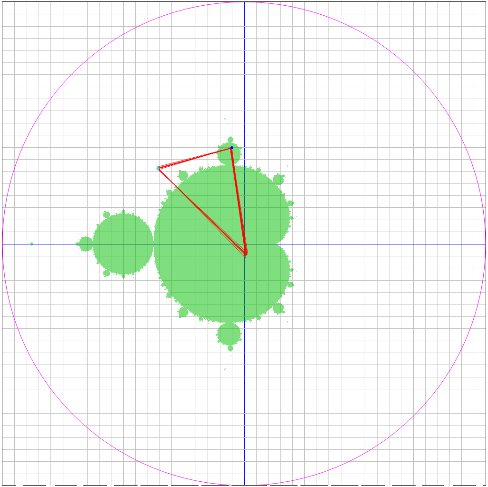
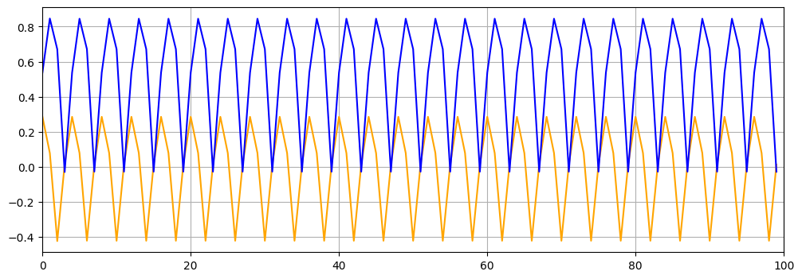
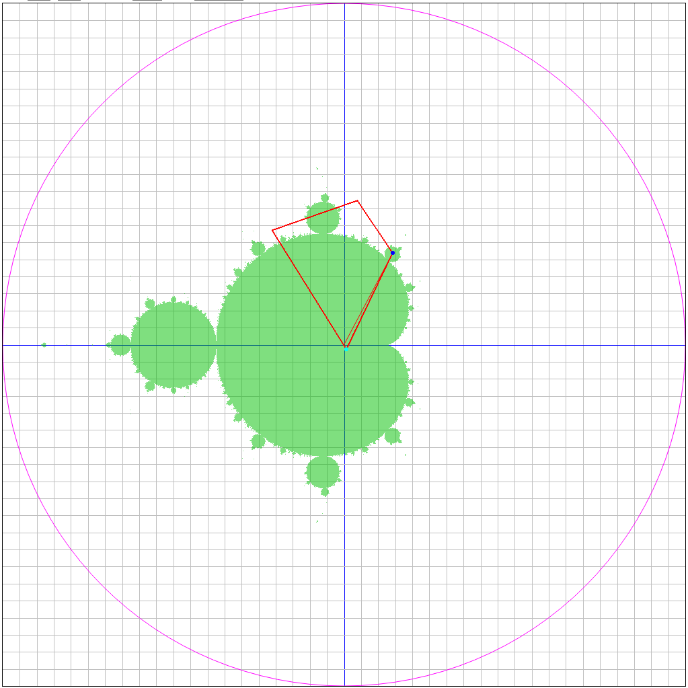
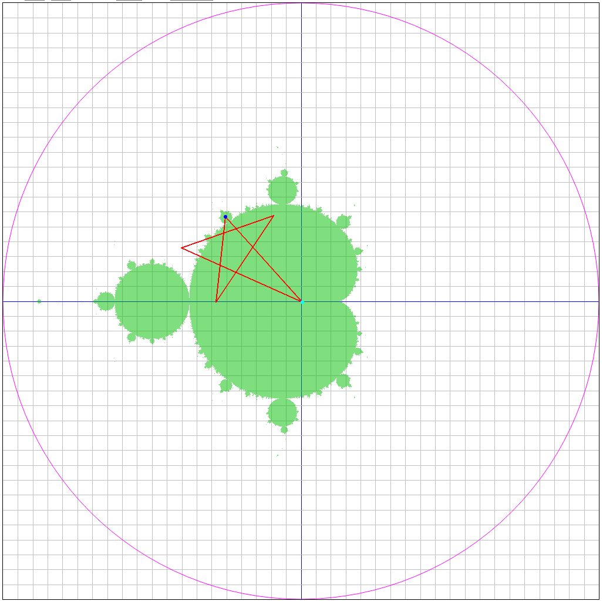
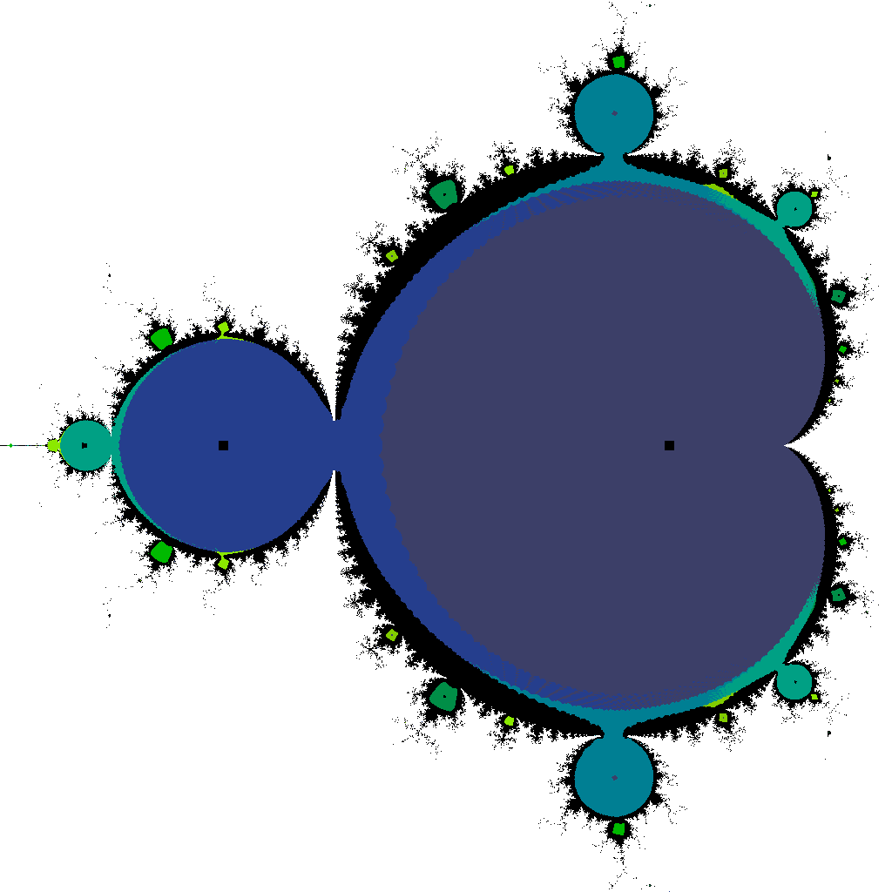

# Periodicity checking

"Periodicity checking" is a performance optimisation technique used in fractal image generation. This technique is used to reduce the number of calculations needed to calculate a pixel in the image, therefore reducing the time to generate the full fractal image. For the classic way of generating a Mandelbrot Set image you need to calculate a series of values applying the Mandelbrot formula recursively.

The basic Mandelbrot Set formula is:

`f(z) = z² + c`

In order to generate a fractal image a complex point on the plane is assigned to a pixel in the image.


For a very basic color map (black color inside the fractal and white color outside) you need to find out if the complex number belongs to the Mandelbrot Set. A complex number belongs to the Mandelbrot Set when using that point as `c` variable in the basic formula and applying the formula recursively the series does not diverge.

If you color points inside with black you get something like:



We can calculate some points for that picture. For example, the complex number (0,0) belongs to the set and this is the series:

```math
z = (0,0)
c = (0,0)

f0 = 0
f1 = 0
f2 = 0
f3 = 0
f4 = 0
f5 = 0
f6 = 0
...
```

Obviously the series does not tend to infinite.

Point (0,i) also belongs to the set:

```math
z = (0,0)
c = (0,i)

x0 = z² + c = (0,0)² + (0,i)
x0 =  0 + 1i
x1 = -1 + 1i
x2 =  0 - 1i
x3 = -1 + 1i
x4 =  0 - 1i
x5 = -1 + 1i
...
```

This series values are: i, -1, -i, -1, -i, -1, ...

This is the [orbit for c = (0,i)]((https://mandelbrot-set-periods.online/api/orbits?zx=0&zy=1)):

Orange is the real part and blue the imaginary part.

Point (0,2i) not belonging to the set:

```math
z = (0,0)
c = (-1,0)

x0 = 0
x1 = 2i
x2 = -4 + 2i
x3 = 12 - 14i
x4 = -52 - 334i
x5 = BIG (meaning far from the origin)
x6 = BIGGER
```

This is the [orbit for c = (0,2i)]((https://mandelbrot-set-periods.online/api/orbits?zx=0&zy=2)):

Orange is the real part and blue the imaginary part.

We always start with `z = 0` and that's called the orbit of `0` under iteration of `z² + c`. Under iteration of `f(z) = z² + c`, either the orbit of `0` goes to infinity, or it does not. The Mandelbrot Set represents the set of complex numbers whose fate for the orbit of `0` under iteration of `f(z) = z² + c` does not diverge, that's to say it does tend to infinite.

When the orbit does not go to infinity, it may behave in different ways. It may be fixed or cyclic or behave chaotically. This is the list of possible behaviors:

* Tends to a fixed point (inside)
* Chaotic behavior (inside)
* Chaotic behavior close to n-cycle (inside)
* Period n (inside)
* Go to infinite (outside)

"Periodicity Checking" technique consist on detecting the cycles when we are calculating the orbit for a point `c`, that way we can stop iterations, becuase we know that the series is not going to diverge.

In the plots below, we have displayed the iteration series for `z² + c` for the orbit of `0`, with different orbits periods. You can see two different graph types: real and imaginary vales and orbit lines (lines beetween the points in the series).

Point (-0.495,0.396), tends to a fixed point (period 1):

<https://mandelbrot-set-periods.online/api/orbits?zx=-0.495&zy=0.396>


Point (-1.101,0.100), period 2:  

<https://mandelbrot-set-periods.online/api/orbits?zx=-1.101&zy=0.100>


Point (-0.100,0.764), period 3:

<https://mandelbrot-set-periods.online/api/orbits?zx=-0.100&zy=0.764>


Point (0.286,0.538), period 4:

<https://mandelbrot-set-periods.online/api/orbits?zx=0.286&zy=0.538>


Point (-0.506,0.566), period 5:

<https://mandelbrot-set-periods.online/api/orbits?zx=-0.506&zy=0.566>


As you can see points inside the set have orbits which are trapped inside the limits of the Mandelbrot Set. You can use this site to see the orbits with lines:

<http://www.stefanbion.de/fraktal-generator/mandeliteration.htm>

Or this one:

<https://mandelbrot-set-periods.online>

which is a Mandelbrot Periods Explorer.

If you want to know the cycle length for the different bulbs (a bulb is a cardioid or circle section of the Mandelbrot Set), this is how it looks like:


There are different algorithms for cycle detection. One of them is the Brent's algorithm. You can find an implementation here: <https://github.com/josecelano/c-mandelbrot-arbitrary-precision/blob/master/src/cycle-detection/brent.c>

One of the properties of this cycles is the more you are closer to the fractal border the more iterations you need to became a stable cycle. You also need to increase the tolerance to detect cycles, that means cycles are not pure, the repeated values is not exactly the same.

In fact this application is not able to detect correctly all the periods. If you want to contribute there is an open issue:

<https://github.com/josecelano/c-mandelbrot-arbitrary-precision/issues/2>

There are some fixed and hardcoded values for minimum number of iterations before checking periodicity, the period tolerance and the maximum number of interations. Those values should be calculated dinamically depending on the area, zoom, or other parameters of the image you are rendering.

We have not found a formula for that. We think most of the formulas out there are not exact. And we think it's not possible to find a formula for that in order to draw a perfect Mandelbrot Set with colored periods. This is the best approximation we have been able to generate:



## Acknowledgements

Two articles where specially useful for us to understand periods in Mandelbrot Set. In fact, we would say this article explanation is very similar to the one by Robert L. Devaney, simply adding more graphs.

* [Julien Clinton Sprott](http://sprott.physics.wisc.edu/chaos/manchaos.htm)
* [Robert L. Devaney](http://math.bu.edu/DYSYS/FRACGEOM/node1.html#SECTION00010000000000000000)

## Links

Period checking explanations:

1. [Basic explanation](https://en.wikipedia.org/wiki/Talk:Mandelbrot_set#Periodicity_checking)
2. [Mandelbrot Set Chaos](http://sprott.physics.wisc.edu/chaos/manchaos.htm)
3. [What is the period of the "primary bulbs"](http://math.bu.edu/DYSYS/explorer/tour6.html)
4. [Periods of the Bulbs](http://math.bu.edu/DYSYS/FRACGEOM/node3.html#SECTION00030000000000000000)
5. [Iterations](http://math.bu.edu/DYSYS/FRACGEOM/node1.html#SECTION00010000000000000000)

Cycle detection:

1. [Wikipedia article about cycle detection and different algorithms implementation](https://en.wikipedia.org/wiki/Cycle_detection)
2. [Blog post explaining Brent's Cycle Detection Algorithm by David Aramant](https://davidaramant.github.io/post/brents-cycle-detection-algorithm)
3. [Wikipedia explanation for Brent's algorithm supposedly used by Gnofract 4D](https://en.wikipedia.org/wiki/Cycle_detection#Brent.27s_algorithm)
4. [Explanation about the orbit detection technique](https://mrob.com/pub/muency/orbitdetection.html)
5. [Short explanation about the periodicity checking technique](https://en.wikipedia.org/wiki/Talk:Mandelbrot_set#Periodicity_checking)
6. [How Fractint software implemented it](https://web.archive.org/web/20150220012221/http://www.reocities.com/CapeCanaveral/5003/mandel.htm)
7. [Orbit detection](https://mrob.com/pub/muency/orbitdetection.html)

Sample implementations:

1. [C implementation using Gnofract 4d](https://github.com/HyveInnovate/gnofract4d/blob/master/examples/cpp/custom_mandelbrot_formula.c#L356-L389)
2. [Another C implementation with arbitrary precision](https://github.com/josch/mandelbrot/blob/master/mandel_mpfr.c#L109-L133)
3. [Java implementation](https://en.wikipedia.org/wiki/User:Simpsons_contributor/periodicity_checking)

Orbit visualization:

1. [Draw orbit with lines between point in the series](http://www.stefanbion.de/fraktal-generator/mandeliteration.htm)

Math:

1. [Periodic points of complex quadratic mappings](https://en.wikipedia.org/wiki/Periodic_points_of_complex_quadratic_mappings)
2. [How to find periodic points for given period](https://en.wikibooks.org/wiki/Fractals/Iterations_in_the_complex_plane/periodic_points#How_to_find_periodic_points_for_given_period?)
3. [Paper: The size of Mandelbrot bulbs](https://www.sciencedirect.com/science/article/pii/S259005441930017X)

Wiki/Books:

1. [WikiBook about fractals](https://en.wikibooks.org/wiki/Fractals)

Images:

1. [Mandelbrot Set with periodicities coloured](https://upload.wikimedia.org/wikipedia/commons/0/0e/Mandelbrot_Set_%E2%80%93_Periodicities_coloured.png)

Software using perdiodicity checking:

1. [Gnofract 4D](https://github.com/fract4d/gnofract4d)