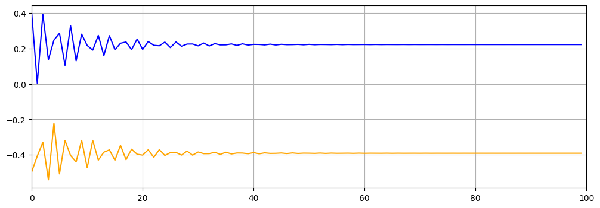
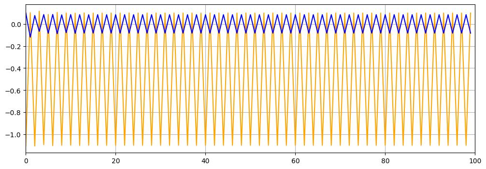

## Periodicity checking

TODO

Types of orbits:
* Tends to a fixed point (inside)
* Chaotic behavior (inside)
* Chaotic behavior close to n-cycle (inside)
* Period n (inside)
* Go to infinite (outside)
           
In the plots below, we have displayed the iteration series for `z² + c` for the orbit of 0, with different orbits types.
           
Point (-0.1,0.1), tends to a fixed point:           

Point (0,1), period 2:  

Point (-0.1,0.7), period 3  

Point (-1.3,0), period 4:  

Mandelbrot coloured with periodicities:

### Links

Cycle detection:

1. [Wikipedia article about cycle detection and different algorithms implementation](https://en.wikipedia.org/wiki/Cycle_detection)
2. [Blog post explaining Brent's Cycle Detection Algorithm by David Aramant](https://davidaramant.github.io/post/brents-cycle-detection-algorithm)
3. [Wikipedia explanation for Brent's algorithm supposedly used by Gnofract 4D](https://en.wikipedia.org/wiki/Cycle_detection#Brent.27s_algorithm)
4. [Explanation about the orbit detection technique](https://mrob.com/pub/muency/orbitdetection.html)
5. [Short explanation about the periodicity checking technique](https://en.wikipedia.org/wiki/Talk:Mandelbrot_set#Periodicity_checking)
6. [How Fractint software implemented it](https://web.archive.org/web/20150220012221/http://www.reocities.com/CapeCanaveral/5003/mandel.htm)

Sample implementations:

1. [C implementation using Gnofract 4d](https://github.com/HyveInnovate/gnofract4d/blob/master/examples/cpp/custom_mandelbrot_formula.c#L356-L389)
2. [Another C implementation with arbitrary precision](https://github.com/josch/mandelbrot/blob/master/mandel_mpfr.c#L109-L133)
